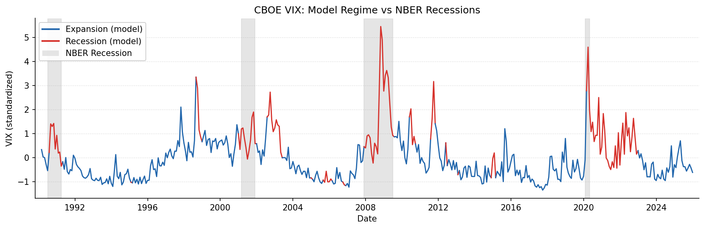

# Regime-Based Asset Allocator

> **In Search of Alpha in Macroeconomic Hidden Regimes: A Tactical Asset Allocation Framework**

A rigorous comparison of Gaussian HMM and MSMH-VAR(1) models for macroeconomic regime detection, applied to a three-asset tactical allocation portfolio (U.S. equities, Treasuries, gold). Regime-conditional mean-variance optimization via cvxpy with Ledoit-Wolf and Bayes-Stein shrinkage. Out-of-sample evaluation via expanding-window walk-forward backtesting with filtered regime probabilities.

→ [Methodology](docs/METHODOLOGY.md) · [Results](docs/RESULTS_SUMMARY.md)



------------------------------------------------------------------------

## Motivation

The 2022 episode — U.S. equities fell \~19% and bonds fell \~13% simultaneously — exposed a fundamental flaw in standard portfolio construction: mean-variance optimization assumes stable correlations across market environments. Diversification failed precisely when it was needed most.

This project builds a regime-aware allocation framework where portfolio weights adapt to detected macroeconomic states, with the goal of improving risk-adjusted performance relative to static benchmarks.

------------------------------------------------------------------------

## Models and Design

| Model    | Preprocessing        | Role                 |
|----------|----------------------|----------------------|
| **HMM**  | PLS (4 components)   | Primary model        |
| HMM      | PCA (\~70% variance) | Robustness check 1   |
| MSVAR(1) | PCA (\~70% variance) | Robustness check 2 † |

† The MSVAR VAR mean structure is not economically interpretable on PCA components; included for completeness only.

**PLS over PCA:** PLS finds latent macro directions that maximally co-vary with asset returns, aligning preprocessing to the portfolio objective rather than to variance in the macro indicators. The empirical case for PLS rests on two findings: the walk-forward backtest (HMM-PLS Sortino 1.512 vs HMM-PCA 1.381), and the fact that only HMM-PLS correctly detects the 1990–91 recession — a short, oil-shock-driven contraction that all PCA-based and no-reduction variants miss entirely. See [Methodology](METHODOLOGY.md) for full discussion.

**Walk-forward over fixed split:** At each annual refit, all model components are re-estimated on the full expanded dataset — scaler, dimensionality reducer, regime model, and regime-conditional return moments. Between refits, regime assignment uses filtered probabilities only (no look-ahead), with a one-month signal lag before weights are applied. See [Methodology](docs/METHODOLOGY.md) for full design details.

------------------------------------------------------------------------

## Results

### Out-of-Sample Performance (Jan 2019 – Dec 2025, 84 months)

*Expanding-window walk-forward · Annual refit · Filtered regime probabilities · RF: 2.66% p.a. · 10 bps one-way transaction costs · Ranked by Sortino ratio*

| Rank | Strategy | Sortino | Sharpe | Ann. Return | Volatility | Max DD |
|-----------|-----------|-----------|-----------|-----------|-----------|-----------|
| 1 | Equal Weight | 1.590 | 0.928 | 12.0% | 9.9% | −19.6% |
| 2 | **HMM GMV (PLS, WF)** | **1.512** | **0.888** | **11.7%** | **10.0%** | **−20.0%** |
| 3 | HMM GMV (PCA, WF) | 1.381 | 0.812 | 10.9% | 10.2% | −20.4% |
| 4 | Unconditional GMV (WF) | 1.325 | 0.792 | 10.7% | 10.1% | −21.2% |
| 5 | MSVAR GMV (PCA, WF) † | 1.317 | 0.787 | 10.7% | 10.2% | −21.2% |
| 6 | Buy & Hold Equity | 1.300 | 0.871 | 17.2% | 16.9% | −24.0% |
| 7 | 60/40 (static) | 0.948 | 0.604 | 10.0% | 12.8% | −25.8% |

† MSVAR VAR mean structure not economically interpretable on PCA components; included as robustness check only.

Sortino is the primary criterion since it penalizes only downside volatility. The divergence with Sharpe is stark: buy-and-hold equity ranks third by Sharpe but second-to-last by Sortino, as its 17.2% average return comes with a −24.0% maximum drawdown and 9.5% monthly CVaR.

**The first-order effect of gold:** The top two strategies — equal weight and HMM-PLS — are those with the highest gold allocation relative to a standard equity-bond portfolio. Gold's low or negative correlation with both equities and Treasuries, particularly during the 2022 rate-hike shock when both traditional asset classes fell simultaneously, provides the tail protection that drives the Sortino advantage. Equal weight captures this unconditionally via a permanent 33% allocation; HMM-PLS captures it conditionally by rotating toward gold during detected contraction regimes.

**HMM-PLS is the top-ranked model-based strategy**, outperforming 60/40 by 167 bps of annualized return at 277 bps lower volatility and 576 bps shallower maximum drawdown. Against the unconditional GMV walk-forward — the most natural model-free benchmark, using the same expanding-window discipline but no regime information — HMM-PLS adds 80 bps of annualized return and +0.187 Sortino, isolating the contribution of regime detection itself.

### Subperiod Analysis

| Subperiod | HMM-PLS Sortino | HMM-PCA Sortino | MSVAR-PCA Sortino | 60/40 Sortino |
|---------------|---------------|---------------|---------------|---------------|
| Full period (84m) | 1.512 | 1.381 | 1.317 | 0.948 |
| COVID-19 (2020) | 11.43 | 13.13 | 6.80 | 2.71 |
| Inflation / rate hikes (2021–22) | −0.697 | −0.770 | −0.804 | −0.419 |
| Post-2022 normalization (2023–25) | 2.593 | 2.422 | 2.411 | 1.483 |

HMM-PLS loses least in absolute terms during 2021–2022 among all model-based strategies. Equal weight (−0.708) narrowly outperforms it — driven by its permanent gold allocation providing insulation when equities and bonds fell simultaneously.

**GMV dominates MVO** across all model variants (HMM Sortino 1.294 vs 0.825; MSVAR 1.241 vs 0.763), consistent with estimation error in regime-conditional mean returns. See [Results](RESULTS_SUMMARY.md) for full subperiod tables.

------------------------------------------------------------------------

## Project Structure

```         
regime-based-asset-allocator/
├── data/                        # Raw and cleaned macro + market data
├── notebooks/
│   ├── 01_data_extraction.ipynb
│   ├── 02_data_wrangling.ipynb
│   ├── 03_dimensionality_reduction.ipynb   # PCA vs PLS analysis
│   ├── 04_hmm_experiments.ipynb
│   ├── 05_msvar_experiments.ipynb
│   ├── 06_backtesting.ipynb                # Fixed-split (appendix)
│   └── 07_walk_forward.ipynb              # Primary evaluation
├── src/
│   ├── hmm_model.py        # Gaussian HMM with multiple restarts
│   ├── msvar.py            # Custom MSMH-VAR(1): Hamilton filter + Kim smoother EM
│   ├── msvar_model.py      # MSVARRegimeModel wrapper
│   ├── portfolio.py        # MVO with Ledoit-Wolf + Bayes-Stein shrinkage (cvxpy)
│   ├── backtest.py         # Backtest engine with drift-adjusted transaction costs
│   ├── benchmarks.py       # Static benchmark portfolios
│   ├── metrics.py          # Performance metrics (Sharpe, Sortino, VaR, CVaR)
│   ├── plots.py            # Regime visualization + backtest dashboard
│   ├── preprocess.py       # Robust scaling, PCA, PLS, dimensionality reduction
│   ├── walk_forward.py     # Expanding-window walk-forward engine
│   ├── regime_mapping.py   # Regime-to-weight mapping
│   ├── data_loader.py      # DuckDB-accelerated data loading if available
│   └── constants.py        # Shared constants (ASSET_COLS etc.)
├── tests/
├── outputs/
│   ├── tables/             # Target weights and Performance CSVs
│   └── figures/            # Charts and regime plots
├── METHODOLOGY.md           # Detailed methodology and design rationale
├── RESULTS_SUMMARY.md       # Full results, subperiod analysis, appendix
├── CONTRIBUTORS.md
├── requirements.txt
└── .env.example
```

------------------------------------------------------------------------

## Setup

``` bash
git clone https://github.com/mydam169/regime-based-asset-allocator.git
cd regime-based-asset-allocator

conda create -n env python=3.13
conda activate env
pip install -r requirements.txt

cp .env.example .env
# Add your FRED API key to .env: FRED_API_KEY=your_key_here
```

Run notebooks in order: `01` → `02_data_wrangling` → `02_dimensionality_reduction` → `03` → `04` → `05` → `06`.

------------------------------------------------------------------------

## References

-   Hamilton, J.D. (1989). A new approach to the economic analysis of nonstationary time series. *Econometrica*.
-   Krolzig, H.-M. (1997). *Markov-Switching Vector Autoregressions*. Springer.
-   Kim, C.-J. (1994). Dynamic linear models with Markov-switching. *Journal of Econometrics*.
-   Kim, C.-J. & Nelson, C.R. (1999). *State-Space Models with Regime Switching*. MIT Press.
-   Ang, A. & Bekaert, G. (2004). How regimes affect asset allocation. *Financial Analysts Journal*.
-   Guidolin, M. & Timmermann, A. (2007). Asset allocation under multivariate regime switching. *Journal of Economic Dynamics and Control*.
-   Kelly, B. & Pruitt, S. (2015). The three-pass regression filter. *Journal of Econometrics*.
-   Ledoit, O. & Wolf, M. (2004). A well-conditioned estimator for large-dimensional covariance matrices. *Journal of Multivariate Analysis*.
-   Jorion, P. (1986). Bayes-Stein estimation for portfolio analysis. *Journal of Financial and Quantitative Analysis*.