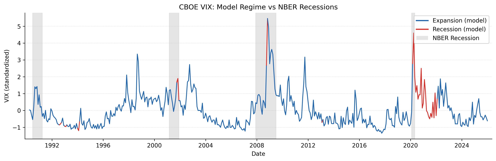

# Regime-Based Asset Allocator

> **In Search of Alpha in Macroeconomic Hidden Regimes: A Tactical Asset Allocation Framework**

A rigorous comparison of Gaussian HMM and MSMH-VAR(1) models for macroeconomic regime detection, applied to a three-asset tactical allocation portfolio (U.S. equities, Treasuries, gold). Estimated via Hamilton filter + Kim smoother (EM algorithm). Regime-conditional mean-variance optimization via cvxpy with Ledoit-Wolf and Bayes-Stein shrinkage.



------------------------------------------------------------------------

## Motivation

The 2022 episode — U.S. equities fell \~19% and bonds fell \~13% simultaneously — exposed a fundamental flaw in standard portfolio construction: mean-variance optimization assumes stable correlations across market environments. Diversification failed precisely when it was needed most.

This project builds a regime-aware allocation framework where portfolio weights adapt to detected macroeconomic states, with the goal of improving risk-adjusted performance relative to static benchmarks.

------------------------------------------------------------------------

## Models

| Model | Description |
|------------------------------------|------------------------------------|
| **Gaussian HMM** | Hidden Markov Model with full Gaussian emissions; fitted via Baum-Welch EM with multiple restarts |
| **MSMH-VAR(1)** | Markov-Switching VAR(1) with regime-dependent means and covariances; estimated via Hamilton filter + Kim smoother EM — no existing Python or R package available, implemented from scratch |

Both models detect K=2 regimes (expansion vs. contraction), with K=3 as a robustness check.

------------------------------------------------------------------------

## Results

### Out-of-Sample Performance (Dec 2018 – Dec 2025)

*Risk-free rate: 2.66% p.a. (test-period FEDFUNDS average) · 10 bps transaction costs*

| Strategy          | Ann. Return | Ann. Volatility | Sharpe    | Sortino   | Max DD     |
|------------|------------|------------|------------|------------|------------|
| **MSVAR (TAA)**   | **12.1%**   | **9.5%**        | **0.970** | **1.563** | **−19.6%** |
| HMM (TAA)         | 10.5%       | 10.1%           | 0.776     | 1.250     | −22.0%     |
| Equal Weight      | 12.2%       | 9.7%            | 0.967     | 1.590     | −19.6%     |
| Buy & Hold Equity | 15.5%       | 17.0%           | 0.780     | 1.189     | −24.0%     |
| 60/40 (static)    | 10.1%       | 12.7%           | 0.616     | 1.037     | −25.7%     |

**MSVAR achieves the highest Sharpe ratio and lowest drawdown of all strategies.**

### Regime Stability

| Model | Expansion Duration | Contraction Duration |
|-------|--------------------|----------------------|
| HMM   | 35.6 months        | 3.4 months           |
| MSVAR | 56.6 months        | 4.7 months           |

MSVAR produces more stable regime classifications and lower portfolio turnover than HMM, consistent with its richer VAR(1) autoregressive structure.

### Stress Tests

| Period | HMM Cum. Return | MSVAR Cum. Return | HMM Sharpe | MSVAR Sharpe |
|---------------|---------------|---------------|---------------|---------------|
| Full test (85 months) | 102.8% | 124.3% | 0.776 | 0.970 |
| COVID-19 (2020) | 21.8% | 19.1% | 2.058 | 1.895 |
| Inflation 2021–2022 | −14.2% | −10.9% | −0.895 | −0.774 |
| Post-2022 | 51.3% | 66.4% | 1.202 | 1.642 |

------------------------------------------------------------------------

## Project Structure

```         
regime-based-asset-allocator/
├── data/                   # Raw and cleaned macro + market data
├── notebooks/
│   ├── 01_data_extraction.ipynb
│   ├── 02_data_wrangling.ipynb
│   ├── 03_hmm_experiments.ipynb
│   ├── 04_msvar_experiments.ipynb
│   └── 05_backtesting.ipynb
├── src/
│   ├── hmm_model.py        # Gaussian HMM with multiple restarts
│   ├── msvar.py            # Custom MSMH-VAR(1): Hamilton filter + Kim smoother EM
│   ├── msvar_model.py      # MSVARRegimeModel wrapper
│   ├── portfolio.py        # MVO with Ledoit-Wolf + Bayes-Stein shrinkage (cvxpy)
│   ├── backtest.py         # Backtest engine with drift-adjusted transaction costs
│   ├── benchmarks.py       # Static benchmark portfolios
│   ├── metrics.py          # Performance metrics (Sharpe, Sortino, VaR, CVaR)
│   ├── plots.py            # Regime visualization + backtest dashboard
│   ├── preprocess.py       # Standardization and train/test split
│   ├── regime_mapping.py   # Regime-to-weight mapping
│   ├── data_loader.py      # DuckDB-accelerated data loading if available
│   └── constants.py        # Shared constants
├── tests/
├── outputs/
├── requirements.txt
└── .env.example
```

------------------------------------------------------------------------

## Methodology

**Data:** 13 monthly macroeconomic indicators from FRED (1990–2025): industrial production, real personal income, unemployment rate, initial jobless claims, CPI, oil price, VIX, credit spread, yield curve slope, federal funds rate, consumer sentiment, housing starts, M2 money supply. Transformed to stationary growth rates (log-differences or first differences per ADF/KPSS tests) and standardized.

**Assets:** VFINX (S&P 500 index fund), VUSTX (long-term Treasury fund), gold (USD/oz) — monthly returns from 1990.

**Regime detection:** EM algorithm with multiple random restarts. Regime labels cross-referenced against NBER official recession dates.

**Portfolio optimization:** Regime-conditional MVO with Ledoit-Wolf covariance shrinkage and Bayes-Stein expected return shrinkage. Benchmarked against GMV in Appendix A to confirm shrinkage choice is not driving results.

**Backtesting:** Out-of-sample evaluation Dec 2018 – Dec 2025. One-month signal lag applied to prevent look-ahead bias. 10 bps one-way transaction costs with drift-adjusted turnover tracking.

------------------------------------------------------------------------

## Setup

``` bash
git clone https://github.com/mydam169/regime-based-asset-allocator.git
cd regime-based-asset-allocator

conda create -n env python=3.13
conda activate env
pip install -r requirements.txt

cp .env.example .env
# Add your FRED API key to .env: FRED_API_KEY=your_key_here
```

Run notebooks in order: `01` → `02` → `03` → `04` → `05`.

------------------------------------------------------------------------

## Known Limitations and Future Work

-   **Walk-forward validation** — the current design uses a fixed 80/20 train/test split; expanding-window walk-forward with filtered (not smoothed) probabilities would eliminate residual look-ahead bias
-   **PCA on macro indicators** — 13 correlated inputs create parameter pressure for the MSVAR; dimensionality reduction to 4–5 principal components is a natural extension
-   **Parameter uncertainty** — regime-conditional moments are treated as known; accounting for estimation error in μ and Σ (e.g., via Bayesian posterior) would produce more conservative allocations

------------------------------------------------------------------------

## References

-   Hamilton, J.D. (1989). A new approach to the economic analysis of nonstationary time series. *Econometrica*.
-   Krolzig, H.-M. (1997). *Markov-Switching Vector Autoregressions*. Springer.
-   Kim, C.-J. (1994). Dynamic linear models with Markov-switching. *Journal of Econometrics*.
-   Ang, A. & Bekaert, G. (2004). How regimes affect asset allocation. *Financial Analysts Journal*.
-   Guidolin, M. & Timmermann, A. (2007). Asset allocation under multivariate regime switching. *Journal of Economic Dynamics and Control*.
-   Kritzman, M., Page, S. & Turkington, D. (2012). Regime shifts: Implications for dynamic strategies. *Financial Analysts Journal*.
-   Ledoit, O. & Wolf, M. (2004). A well-conditioned estimator for large-dimensional covariance matrices. *Journal of Multivariate Analysis*.